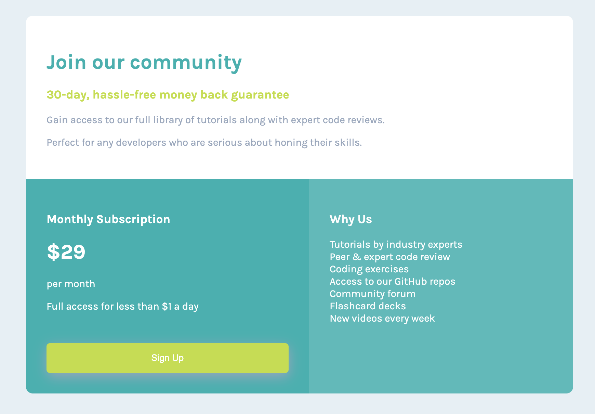

# Frontend Mentor - Single price grid component solution

This is a solution to the [Single price grid component challenge on Frontend Mentor](https://www.frontendmentor.io/challenges/single-price-grid-component-5ce41129d0ff452fec5abbbc). Frontend Mentor challenges help you improve your coding skills by building realistic projects. 

## Table of contents

- [Frontend Mentor - Single price grid component solution](#frontend-mentor---single-price-grid-component-solution)
  - [Table of contents](#table-of-contents)
  - [Overview](#overview)
    - [The challenge](#the-challenge)
    - [Screenshot](#screenshot)
    - [Links](#links)
  - [My process](#my-process)
    - [Built with](#built-with)
    - [What I learned](#what-i-learned)
    - [Continued development](#continued-development)
    - [Useful resources](#useful-resources)
  - [Author](#author)
  - [Acknowledgments](#acknowledgments)


## Overview

### The challenge

Users should be able to:

- View the optimal layout for the component depending on their device's screen size
- See a hover state on desktop for the Sign Up call-to-action

### Screenshot




### Links

- Solution URL: [Github](https://github.com/mariabrock/frontendmentor-single-price-grid)
- Live Site URL: [Github Pages](https://your-live-site-url.com)

## My process

### Built with

- Semantic HTML5 markup
- CSS custom properties
- Flexbox
- CSS Grid
- Mobile-first workflow


### What I learned

Here's some fun code:

```html
  <div id="subscription" class="card 2">
    <h3>Monthly Subscription</h3>

    <h1>&dollar;29</h1>
    <p>per month</p>

    <p>Full access for less than &dollar;1 a day</p>
    <button>Sign Up</button>
  </div>
```
```css
 #top {
  background-color: white;
  color: hsl(218, 22%, 67%);
  grid-column: 1/span 2;
  border-top-left-radius: 10px;
  border-top-right-radius: 10px;
  .header{
    color: hsl(179, 62%, 43%);
  }
  .subtitle {
    color: hsl(71, 73%, 54%);
  }
}
```

### Continued development

 - Undefined

### Useful resources

- [W3 Schools](https://www.w3schools.com/) - Super helpful HTML & CSS reference.

## Author

- Github - [@mariabrock](https://github.com/mariabrock)
- Frontend Mentor - [@mariabrock](https://www.frontendmentor.io/profile/mariabrock)
- LinkedIn - [@mariabrock](https://www.linkedin.com/in/maria-brock/)


## Acknowledgments


